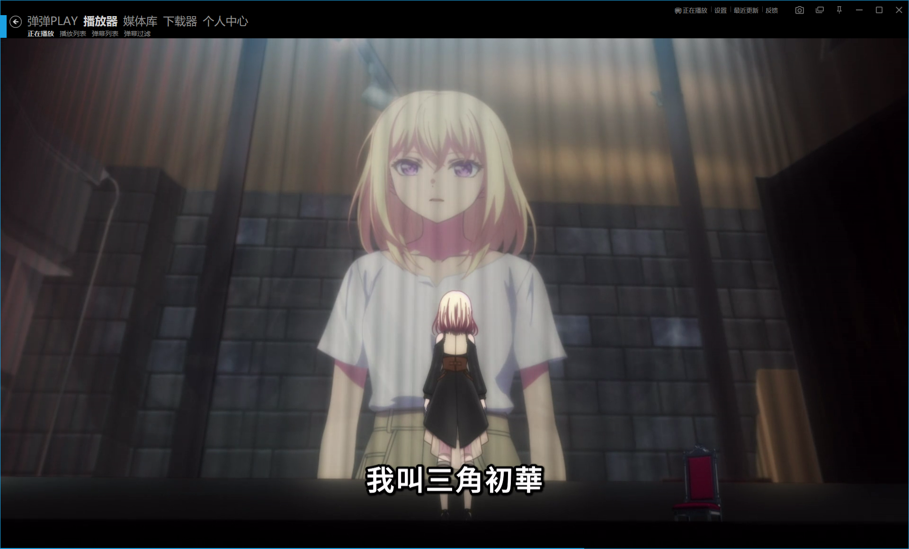
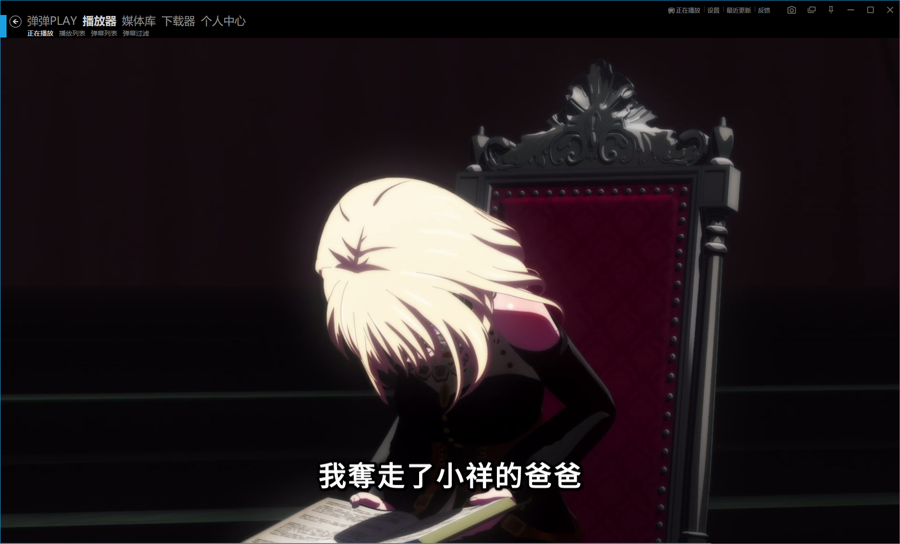
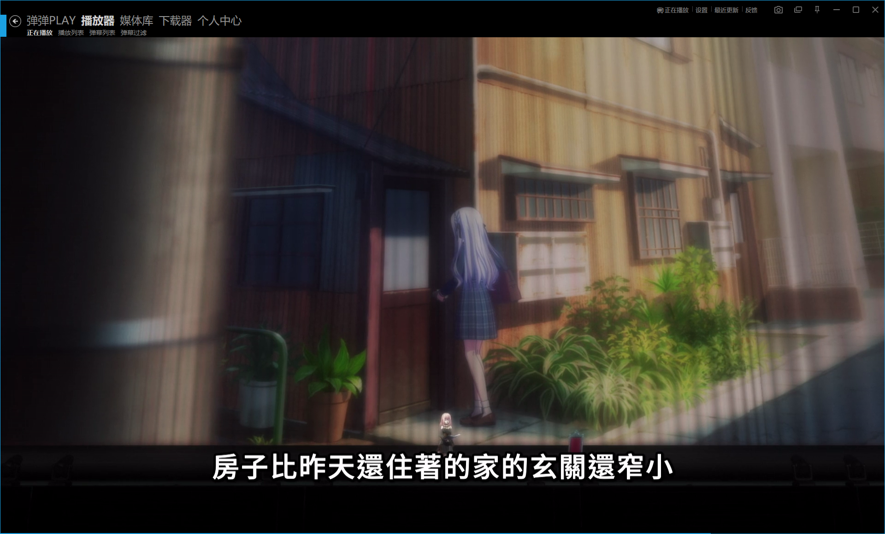
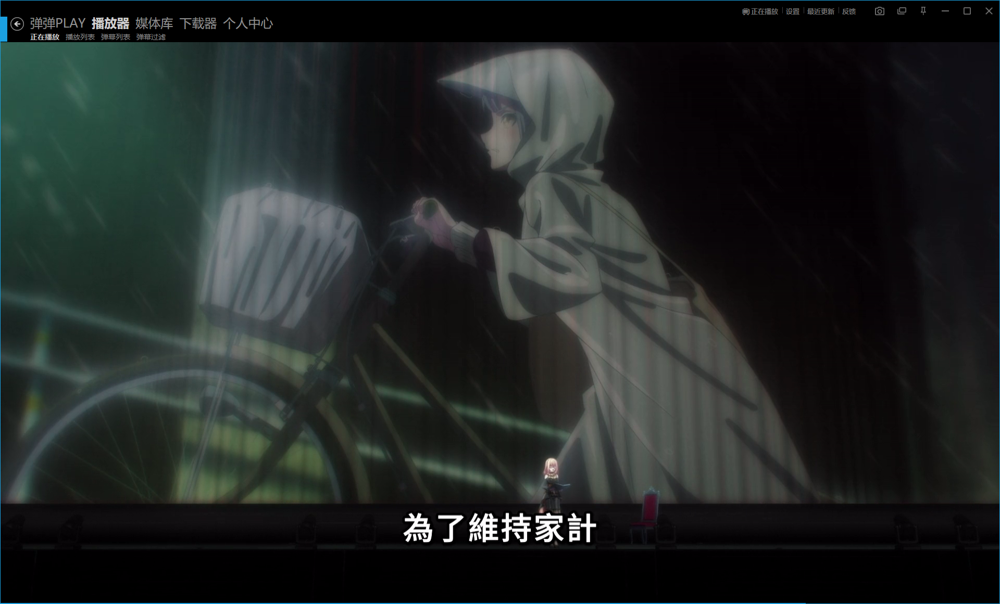
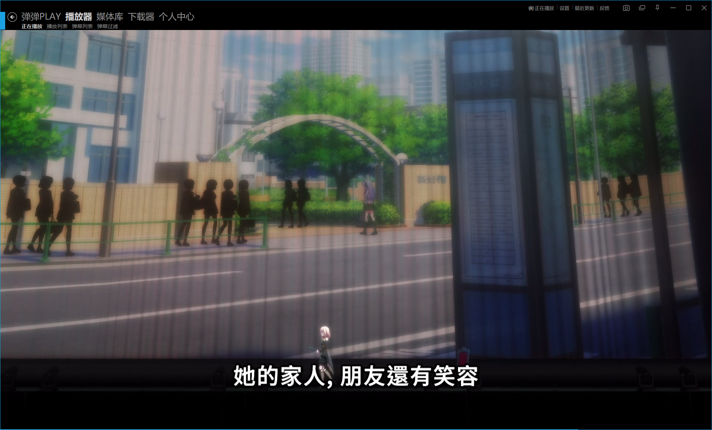
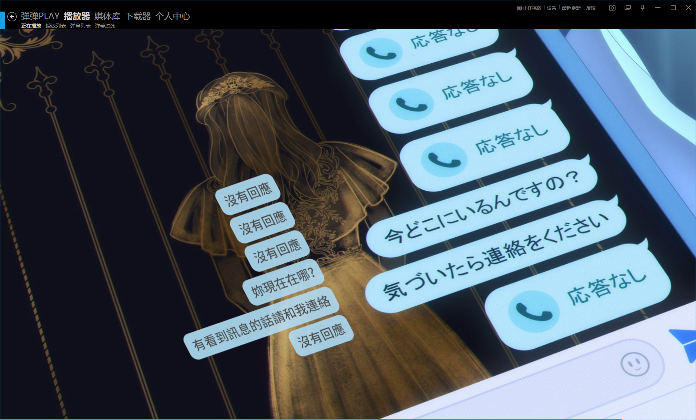
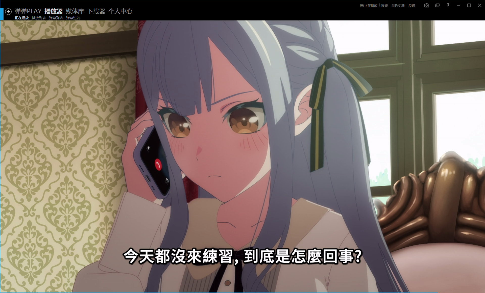
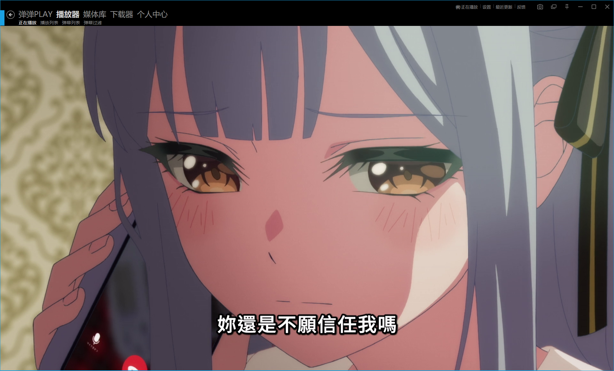

> 如果一坨史闻起来像史吃起来也像史，那么不用怀疑，这就是史。

太幽默了这集，开头听了五分钟初音未来讲自己的过去之后，我开始发觉不对劲了。

> 在吃完这坨二十分钟的史后，我是否会想起，二十分钟前，我大胆的猜测。初音不会要讲一整集吧。

这前半段的剧情实在太有女频文的味道了——两个外貌相似性格相反的孩子，其中一个是私生子，渴望着取代另一个孩子。初音狡诈的欺骗了祥子，在最后一天，将初华的一切都夺了过来，要我说，这又是伪物想成为真物的故事。妈的全部人都像成为人类，真是类人群星闪耀时。

在看到初音来到东京打拼之后，我又绷不住了，太君他们是不做背调的吗？她说自己叫这名字你们也就信了？

然后一看，哦，又是TGW GROUP的大手，哎乐队，哎斗财阀。

而看到这里，我真的充满了疑惑，发生什么事了，为什么初音未来突然说全都是自己的错，我怎么看不懂，重新打开弹幕看了一遍，哦，原来是祥爹人太好，被丰川集团陷害了，霍霍，到11集了还有祥爹的人设回撤的喔。

而看到接下来的场景，我相信没有几个母鸡卡观众能绷得住，而且都会在脑内发出一个疑惑：姐们，你又是怎么知道的？

笑嘻了，你小子，旷课假装去排练，其实是去跟踪丰川祥子是吧，骇死我里，是重力女同，大家快退吔！

而讲完了初音的回忆杀，回到现实中来之后，我愿称这短短的三分钟为全集的精华部分，真的，很难不笑出声。

先是丰川祥子被曾经冷暴力过的人给冷暴力，笑死了，你也有今天？

然后更是登神台阶，神来之笔——海铃的电话。

笑死我了，到这里，我才想起来，对哦，原来你们还组了个乐队来着，丰川祥子第10集才说：我们是命运共同体，不论生病或是健康，我们都要一直在一起，这集就翘练习了，太幽默了吧，而接下来更幽默的是我们的冰姐海铃：

这种感觉，就像是在公厕吃到了自己家曾经吃过的熟悉的史的味道，我服了，特摄的不停重复口号魔怔人还在追我，都重组乐队了，海铃还在这信任信任的，她是脑子坏了？

总而言之，这集真是幽默完了，高情商：发挥依旧稳定，低情商：烂完了。

> 真是好大一坨史啊，散会！
