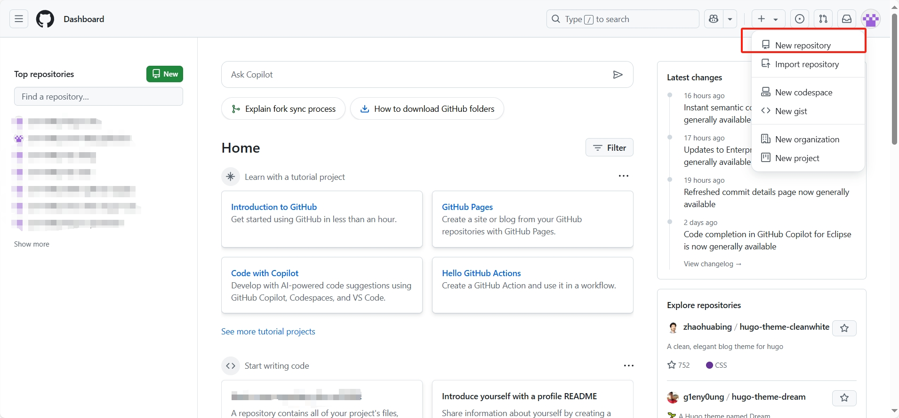

## 写在前面

没想到我居然有动力写第二期啊~~主要再不写我就不记得了~~，那么这期大概会讲一下本地hugo静态站点的制作。

## Github仓库的创建

在第【01】期里，我们已经完成了github的注册，接下来我们登录github：
[GitHub](https://github.com/)

**这里比较关键，**我们可以看到自己的首页



点击右上角的+号，选择新建一个仓库，仓库名随自己喜欢，比如hugo-site，仓库一定要选**公开Public**！不然后期用netlify就没法访问仓库了，**不要勾选添加readme文件，**其他选项保持默认即可，这样你就创建了一个新的仓库。

## Hugo本地站点搭建

接下来，进入你空间比较多的磁盘，比如D盘，新建一个文件夹，起名可以随意，比如myblog之类的，右键文件夹的空白位置，出现`open git bash here`（此处没出现这个按钮的小伙伴检查自己git for window是否正确安装），点击这个选项，出现git bash终端，这个终端将是我们接下来主要使用的一个终端。

### 初始化并绑定github仓库

首先初始化文件夹。在终端分别输入：

```gitattributes
hugo new site . --force
git init
```

此时你的文件夹内应该包含最基本的文件以及.git文件。要注意的是，git bash终端不能直接输入`ctrl+V`来复制粘贴，请**在终端右键点击paste来粘贴代码。**

然后，输入以下代码关联你的github远程仓库。

```gitattributes
git remote add origin https://github.com/你的GitHub用户名/hugo-site.git
```

以防万一，创建一个.gitignore文件，输入

```gitattributes
echo "public/" >> .gitignore
```

这是为了防止给远程仓库推送public静态文件（我们之后使用的netlify会根据源文件自动生成静态站点，所以此刻我们需要将网站的源文件推送到仓库内）。

### 选择主题

访问
[Complete List | Hugo Themes](https://themes.gohugo.io/)
选择你喜欢的博客主题，点击download查看项目地址：


hugo的主题库内容并不丰富，如果想要自己的博客更加丰富多彩，请**改用hexo或者使用wordpress一站式网站部署平台**，具体的教程在网络上非常详细，请根据自己的精力和兴趣合理查阅。

以我使用的stack主题为例，在git bash输入：

```gitattributes
git clone https://github.com/CaiJimmy/hugo-theme-stack themes/stack
```

前面是这个主题的项目地址.git，后面是文件所在目录，根据你选择的主题不同，请自行更改代码。

一般而言打开themes/stack/exampleSite，就是主题官方会给我们的示例网站，但是有些主题官方并没有将examplesite放入文件中，碰到这种情况请访问主题官方仓库自行下载examplesite解压到themes/你的主题/。


将examplesite目录下的content复制到根目录（myblog/），注意，最好不要复制content/post，因为里面有一些国内无法访问的油管视频，可能会导致网站打不开，然后，将theme/assets/icon复制到根目录，这是因为有些图标用了这个文件夹下的图标。

随后，打开examplesite里的hugo.yaml（根据主题的不同，也有可能叫config.yaml或者config.yml），这就是你的网站的配置文件，也就是框架。在高版本hugo中，仅支持toml格式的配置文件，所以请使用一些在线转换器手动转换，如：
[YAML to TOML](https://transform.tools/yaml-to-toml)

- - -

施工中
