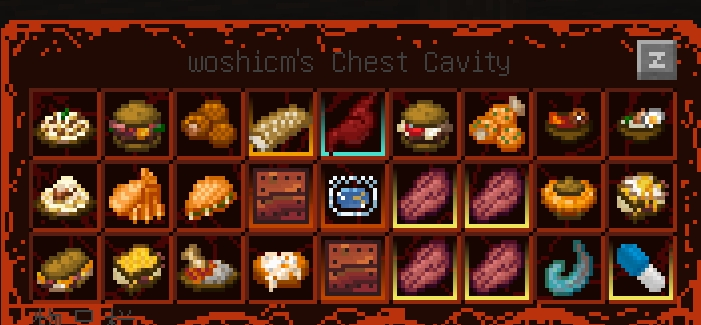
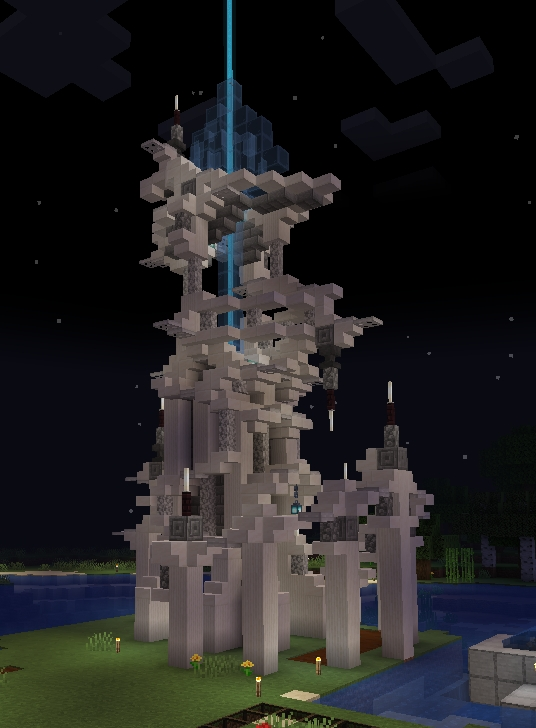
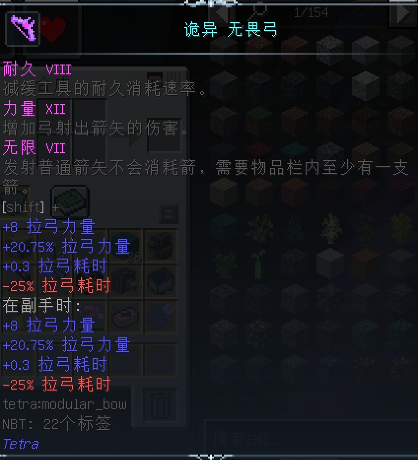
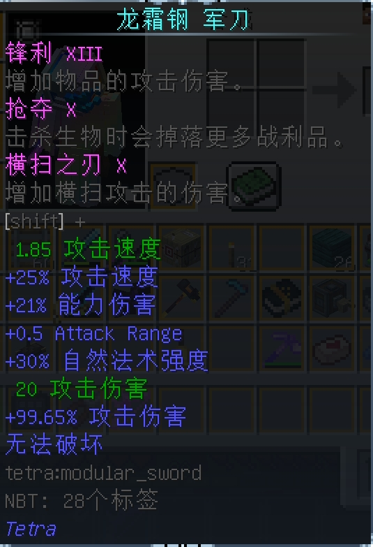
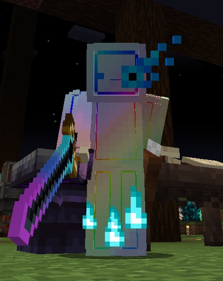

> 玩脆骨症之前，我一度认为MC的高版本冒险战斗整合包都是水货。

## 总评：8.5/10

作为高版本冒险整合包的革新者，《脆骨症》凭借独创的器官构建体系与密集的BOSS战设计树立了新标准。尽管后期数值失衡与任务缺失导致终局体验滑坡，但其核心玩法仍展现出超越同类作品的完成度——这是属于硬核玩家的数百小时狂欢，亦是轻度玩家需要谨慎评估的“器官改造实验”。

## 1.模组联动性：⭐⭐⭐⭐

**“器官系统的协同艺术”**

脆骨症在模组的选取上大有讲究，在仅有164个模组，其中大部分为优化模组的情况下，给玩家带来了丰富的可游玩内容，其中的核心模组有：**胸腔**、**血肉重铸**、**机械动力**、**铁魔法**、**tetra**、**诡厄巫法**以及**高质量的结构和BOSS模组**。机械、魔法、巫术、血肉飞升，这些乍一看觉得无比割裂的元素在脆骨症里通过制作组的大量魔改器官很好的融合在一起，例如，在制作强力的胸腔器官时，往往需要用到血肉重铸、机械动力或者诡厄巫法的合成站和各种结构里的素材，而强力的build体系势必离不开tetra的有趣武器或是铁魔法的丰富法术。

在玩家体验了各种模组，打造了属于自己的build之后，再去挑战各种boss，通过开胸器获取boss体内的强力器官，或是用boss的掉落物来制作武器，如此带来的正反馈循环让玩家有动力去挑战脆骨症内多达50多种boss。

然而，尽管脆骨症在器官方面有着很好的模组联动性，但其在器官以外的其他部分却缺少联动，在挑战主线的过程中，经常会感到某些模组的存在意义只是为了提高制作某个器官的难度，在制作完成器官后，就可以将模组抛之脑后，这让一些模组的主体内容与脆骨症的主要玩法产生割裂。

## 2.平衡性：⭐⭐⭐

**“从精密天平到雪崩失控”**

尽管脆骨症在创意方面达到了极致，但不得不提的是，制作组在平衡设计上仍**略有遗憾**。

尽管官方推荐在难度1下进行游玩，但我在游玩过程中依旧选取了绝大多数人通关时的难度（难度4），这是因为官方设计了高于难度4boss才会掉落某些稀有素材的设定，我相信这个难度下的数值依然是制作组进行平衡的重点。

在前期发展的时期，任何一只稍强的怪物都可以轻松秒杀我数十次，紧张刺激的战斗体验驱动我不断更换强力的器官来提升自己，在跟小伙伴们一起挑战boss的过程中也感受到了挑战性。然而，当我做出了某个强力build——**大胃王**之后，原本能轻松虐杀我的各种怪物被我一刀秒杀。大胃王build顾名思义，就是要在胸腔内放置尽可能多的食物，通过核心器官大胃王的食物增益效果，能带来数倍的加成。

让我感到惊讶的是，我做的甚至不是完全体的大胃王，这让我的游戏体验迅速乏味起来，不管多强大的boss，对我来说都是一刀或者两刀秒。因此，我选择继续推进主线，挑战主线的其他内容。然而，我似乎又回到了前期艰难求生的时候，此刻那些平平无奇的小怪又可以轻易杀死我，而我要继续提升自己，只能通过挂机和不停开箱养瘤子（挂机和开箱获得的肿瘤具有随机属性，养瘤子指的是刷出极品属性瘤子的过程）。这个过程让我感到既无聊又有挫败感，尤其是当我看到一箱子的瘤子里却仅有几个满属性瘤子。后期在数值设计上的无聊让我最后没有打完脆骨症的全部主线。

## 3.冒险与探索：⭐⭐⭐⭐⭐

**“地牢美学的巅峰与谷底”**

毫无疑问，脆骨症的冒险探索设计让玩家在前期探索的每一分钟都能感受到新鲜感。来自不同模组的地牢结构以及战利品箱中丰厚的奖励鼓励玩家积极探索，不论是抄起武器与怪物大战三百回合，还是挖地道直取宝箱，都带来了十足的正反馈和刺激体验，而诸如Boss of Mass、地牢浮现之时、灾变等模组带来的大型结构让玩家在探索之余也享受到了十足的视觉体验。

如果硬要说脆骨症在冒险设计上的不足，想必是维度地牢这款模组带来的缺憾。在打完末影龙，做出维度地牢传送门后，我期待着传送门的后面带给我的是精彩多样的冒险旅行，当穿过传送门后，我看到的仅仅是不断重复的无聊解谜，并且，为了获得高级传送门钥匙，我不得不一遍又一遍的闯入维度地牢，在令人头晕的迷宫地图和让人抓破脑袋的枯燥谜题中翻找着低收益的宝箱。

然而，很明显的，这也是维度地牢这个模组本身带来的弊端，因此，我仍然愿意为脆骨症的冒险探索部分打出满分。

## 4.任务设计：⭐⭐⭐

**“骨架完整，血肉缺失”**

脆骨症的任务设计实在算不上惊艳，只有三章的主线，和众多支线不超过20个的分支，都足以称得上糟糕。所幸的是，制作组在任务的文字说明上没有偷懒，通过主线的简单描述，并翻阅不同模组的指引说明书，仍然能够玩懂脆骨症的大部分模组。但我依旧认为，脆骨症的任务设计，可以做到更好，更完善。目前，制作组已经放出了制作1.20.1高版本重置的消息，希望这次制作组在优化内容的同时，也能够重新编写FTB任务，带给玩家更好的体验。

## 5.优化表现：⭐⭐⭐⭐

**“性能奇迹与BUG阴影”**

我使用的电脑搭载了i5-13490的处理器和4060TI的显卡，在游玩脆骨症的过程中，仅仅在后期建造了大型机器以及探索了几万格地图后感到了略微卡顿，这证明制作组在性能优化上做的不错。

然而，从中后期开始，我不断碰到世界暂停更新，无法打开背包，破坏方块没有物品掉落的BUG，每次都只能翻阅错误日志，手动删除报错源的方式来解决，并且，在开启维度地牢后，我的背包里经常会莫名其妙出现箭袋，在我扔掉了之后依旧会回到我的背包，我不清楚是否只有我一人碰到，但频繁出现的这种BUG极大的影响了我的游玩体验，因此在优化表现上我不得不给脆骨症扣除一些分数。

## 总体来说

✅ **革命性器官系统** – 真正实现跨模组联动的设计范本

✅ **BOSS战多样性** – 50+场机制迥异的畅快首领战

✅ **地牢结构美学** – 优秀的地牢结构探索体验

- - -

## 最后附上我的存档截图

